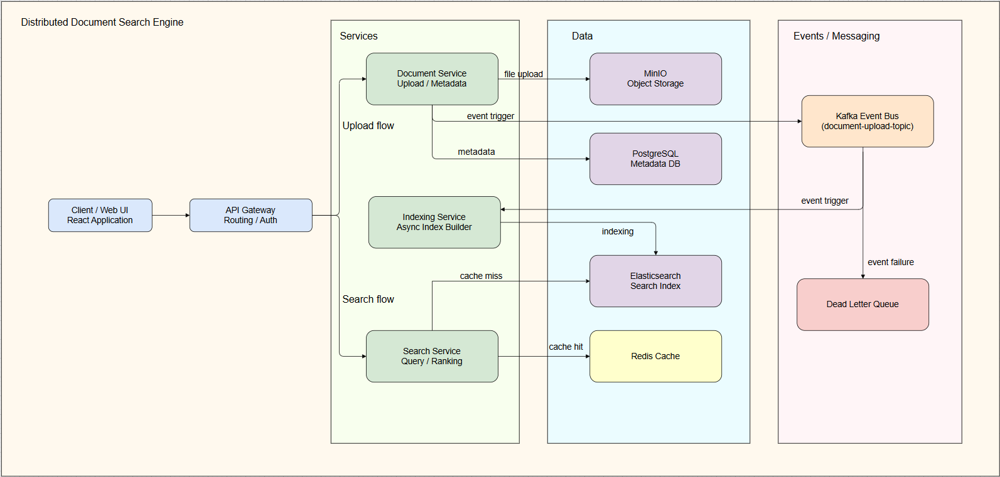

# Distributed Document Search Engine

A scalable distributed system that enables users to upload, index, and perform fast, ranked full-text search on documents with metadata filtering.


## ✨ Features

- JWT-based authentication
- Document upload and storage using MinIO
- Metadata storage in PostgreSQL
- Asynchronous indexing with Kafka
- Full-text search with Elasticsearch
- Redis-based caching for faster queries
- Pagination and filtering support

---

## 🏗️ Architecture

- API Gateway
- Auth Service
- Document Service
- Indexing Service
- Search Service
- Kafka, Redis, PostgreSQL, MinIO, Elasticsearch



---

## 🛠️ Tech Stack

- Java 17, Spring Boot
- PostgreSQL
- MinIO
- Apache Kafka
- Elasticsearch
- Redis
- Docker & Docker Compose

---

## 🔄 High-Level Flow

### 📤 Upload Flow
User → API Gateway → Auth Service → Document Service → MinIO + PostgreSQL → Kafka → Indexing Service → Elasticsearch

### 🔍 Search Flow
User → API Gateway → Search Service → Redis → Elasticsearch

---

## ⚙️ Local Setup

### Prerequisites

- Java 17+
- Docker & Docker Compose
- Node.js (for frontend)

---

### 1. Clone Repository


### 2. Start infrastructurw

```bash
cd infra
docker-compose up -d
```
This will start:

- Kafka & Zookeeper

- PostgreSQL

- Redis

- Elasticsearch

- MinIO

### 3. Run backend
#### i. Build common events
Change the diretory to common events 

    cd services/common-events
    mvn clean install


#### ii. Run gateway
    cd services/api-gateway

    mvn spring-boot:run "-Dspring-boot.run.jvmArguments=-Duser.timezone=Asia/Kolkata"

#### iiI. Run document service
    cd services/document-service

    mvn spring-boot:run "-Dspring-boot.run.jvmArguments=-Duser.timezone=Asia/Kolkata"

#### iv. Run indexing service
    cd services/indexing-service

    mvn spring-boot:run "-Dspring-boot.run.jvmArguments=-Duser.timezone=Asia/Kolkata"

#### v. Run search service
    cd services/search-service
    
    mvn spring-boot:run

### 4. Run frontend
    git clone https://github.com/Sunitab-7869/distributed-document-search-engine-ui

    cd distributed-document-search-engine-ui

    npm install

    npm start
